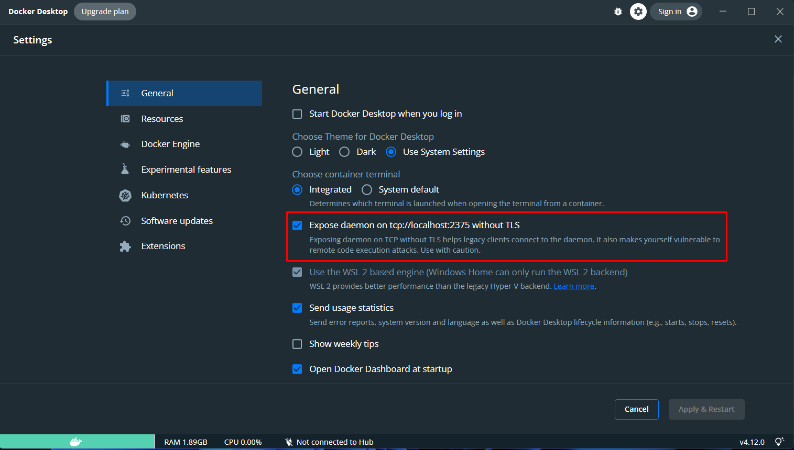

# Solución Reto Java

## Requerimientos

1. Tener seteado la variable de entorno JAVA_HOME, utilizamos JDK8

2. Tener Docker instalado

3. Tener expuesto el daemon de docker sin TLS en tcp://localhost:2375:

   - Docker Desktop

   

   - Linux

   ```bash
   sudo echo "ExecStart=/usr/bin/docker daemon -H fd:// -H tcp://0.0.0.0:2375" >> /lib/systemd/system/docker.service
   sudo systemctl daemon-reload
   sudo systemctl restart docker.service
   ```

### Opcional

1. Tener instalado Terraform
1. Tener instalado el Azure CLI

## Arquitectura Solicitada

1. 01 nginx como puerta de entrada (reverse proxy)

2. 01 backend Java

3. 01 base de datos Postgres

4. Docker ✅

## Comandos para ejecutar

### Bash para compilación y dockerización local

1. Limpiará el build construido y creará un paquete .jar
2. Creará 2 imagenes de docker:
   1. Una tagueada con la versión del proyecto: *retoibm.azurecr.io/microservicios-backend-retoibm:1.0.0-SNAPSHOT*
   2. Una latest: *retoibm.azurecr.io/microservicios-backend-retoibm:latest*

```bash
./build.sh
```

### Aprovisionamiento de la infraestructura en Azure

```shell
# Nos logueamos en Azure
az login
```

#### Recursos

1. Azure Container Registry: 

   Entrar a la carpeta 📂terraform/azure-container-registry

```shell
terraform init
terraform validate
# gitops :D
terraform plan -out "azure-container-registry-plan"
terraform apply -auto-approve

# Para ver los outputs
terraform output
# Para ver la contraseña del registry
terraform output pssw_acr
```

Si se desea destruir los recursos creados:

```shell
terraform destroy -auto-approve
```

## Problemática

0. Almacenar los números y el resultado en una base de datos.

1. Generar un bashero/yml que realice la compilación del backend de forma automática, ejecutando los test unitarios. ✅

2. Generar un DockerFile, que permita construir el build de una imagen de Nginx como reverse-proxy.

3. Generar un DockerFile, que permita construir el build de una imagen con en backend. ✅

4. Generar un DockerFile, que permita construir el build de una imagen personalizada con la base de datos.

5. Generar un bashero/yml que realice la construcción automática de las imágenes mediante los archivos DockerFile respectivos.

6. Generar un bashero/yml que permita ejecutar las imágenes de Nginx y el Backend conectando

   a) Nginx ---> Backend ----> Base Datos

7. Continuous Integration  : Realizar el despliegue mediante un toolchain de ALM (Github + Jenkins+ Sonarqube)

8. Continuous Delivery     : Implementar Docker Registry en Azure ✅, Artifactory, Nexus Sonatype

8. Continuous Deployment   : Realizar un Pipeline (Jenkins, vía código) / Plan (vía código *Bamboo Specs*) para el deploy automático


## Consideraciones

1. Subir los archivos solicitados a Github/Gitlab/Bitbucket en un repositorio en modo público, de manera que todos los archivos puedan ser descargados para su revisión.

2. Considerar al menos un test unitario para el backend.

3. Considerar el build automático del backend mediante un gestor de dependencias (maven, gradle, etc...)

4. Para la base de datos, considerar solo una tabla simple (sumando01, sumando02, resultado)

5. Considerar la cláusula HEALTCHECK dentro del Dockerfile del backend ✅

6. En caso tuvieras problemas con la instalación de docker puedes usar: "https://labs.play-with-docker.com" y recuerda guardar los archivos en tu propio repositorio

7. En caso usaras kubernetes, puedes usar "https://labs.play-with-k8s.com" y recuerda guardar los archivos en tu propio repositorio


## Sugerencias

1. Puedes usar Springboot o Micronaut.io, con los cuales tendrás el backend en custión de minutos.

2. En caso algún punto te resulte complicado puedes avanzar con los demás.

3. El Backend debe poder ser multiréplicas, ten cuidado de no exponer el puerto como external.
