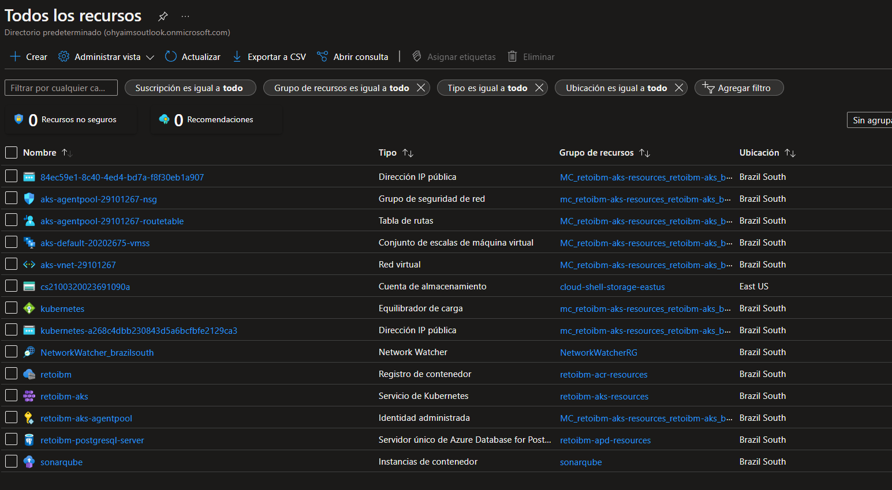
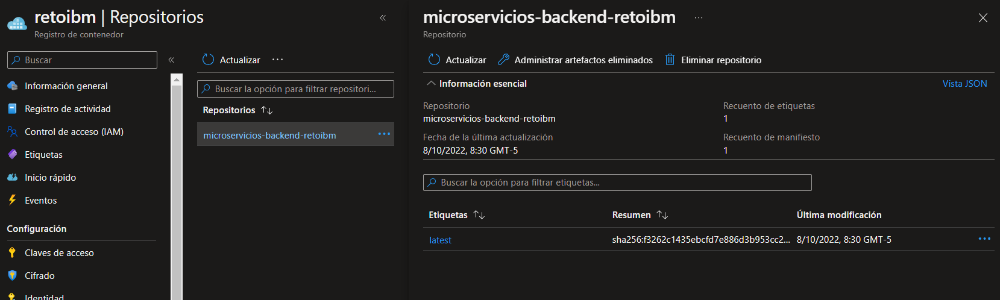
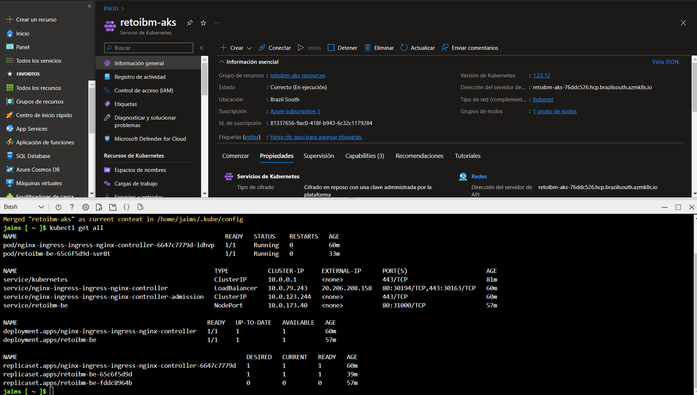
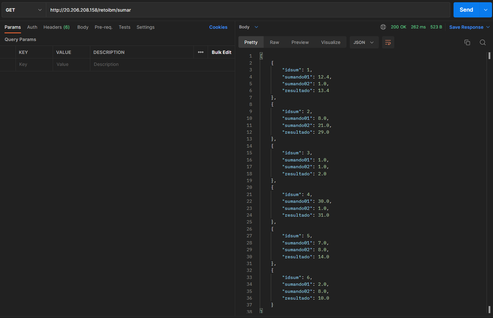
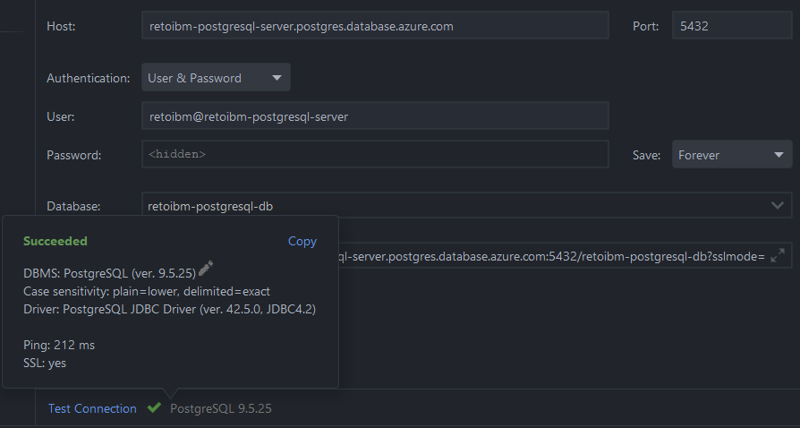
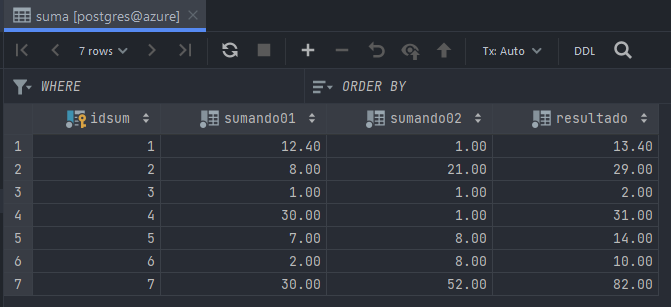

# Solución Reto Java

## Requerimientos

1. Tener seteado la variable de entorno JAVA_HOME, utilizamos JDK8

2. Tener Docker y Docker Compose instalado

3. Tener expuesto el daemon de docker sin TLS en tcp://localhost:2375:

   - Docker Desktop

   

   - Linux

   ```bash
   sudo echo "ExecStart=/usr/bin/docker daemon -H fd:// -H tcp://0.0.0.0:2375" >> /lib/systemd/system/docker.service
   sudo systemctl daemon-reload
   sudo systemctl restart docker.service
   ```

### Opcional

1. Tener instalado Terraform
1. Tener instalado el Azure CLI

## Arquitectura Solicitada

1. 01 nginx como puerta de entrada (reverse proxy) ✅

2. 01 backend Java ✅

3. 01 base de datos Postgres ✅

4. Docker ✅

## Comandos para ejecutar

### Bash para compilación y dockerización local

1. Limpiará el build construido y creará un paquete .jar desde un maven wrapper (corriendo las pruebas unitarias).
2. Creará 2 imágenes de docker:
   1. Una tagueada con la versión del proyecto: *retoibm.azurecr.io/microservicios-backend-retoibm:1.0.0-SNAPSHOT*
   2. Una latest: *retoibm.azurecr.io/microservicios-backend-retoibm:latest*

```bash
./build.sh
```

> Nota: Si se desea cambiar el prefijo de la imagen modificar en el pom.xml la propiedad: docker.image.prefix

## Bash para ejecutar las imágenes automáticamente

1. Ejecutará el bash anterior: build.sh
2. Ejecutará la imagen construida previamente: microservicio
3. Ejecutará la base de datos postgresql
4. Creará un reverse proxy en Nginx

```shell
./run.sh
# ver logs
docker-compose logs -f
# Detener y eliminar contenedores
docker-compose down
```

## Infraestructura Cloud (Azure)

```shell
# Nos logueamos en Azure
az login
```

1. Azure Container Registry

   Entrar a la carpeta 📂terraform/azure-container-registry

```shell
terraform init
terraform validate
# gitops :D
terraform plan -out "azure-container-registry-plan"
terraform apply -auto-approve

# Para ver los outputs
terraform output
# Para ver la contraseña del registry
terraform output pssw_acr
```

Para loguearse al registry privado:

```shell
docker login retoibm.azurecr.io --username retoibm --password Iv+FuMkv2yfGu4L+YHeF+G5HSiszDXwd
```


2. Azure for postgres

   Entrar a la carpeta 📂terraform/azure-postgresdb

```shell
terraform init
terraform validate
# gitops :D
terraform plan -out "azure-postgresdb"
terraform apply -auto-approve

# Para ver los outputs
terraform output
```

3. Azure Container Instance (Sonarqube)

   Entrar a la carpeta 📂terraform/azure-container-instance-sonarqube

```shell
terraform init
terraform validate
# gitops :D
terraform plan -out "azure-container-instance"
terraform apply -auto-approve

# Para ver los outputs
terraform output
```


4. Azure Kubernetes Service
   Entrar a la carpeta 📂terraform/azure-kubernetes-service

```shell
terraform init
terraform validate
# gitops :D
terraform plan -out "azure-kubernetes-service"
terraform apply -auto-approve

# Para ver los outputs
terraform output
```

Si se desea destruir los recursos creados:
```shell
terraform destroy -auto-approve
```


## Correr code-coverage
```shell
./coverage.sh
```

## Correr Jenkins
Entrar a la carpeta 📂jenkins
```shell
docker-compose up -d
```

## Correr manifestos de k8s
Entrar a la carpeta 📂manifests
```shell
kubectl apply -f .
```

## Tabla de Despliegues
| Plataforma                  | Server | Usuario | Contraseña                       |
|-----------------------------|--------|---------|----------------------------------|
| Azure Registry              | retoibm.azurecr.io       | retoibm | Iv+FuMkv2yfGu4L+YHeF+G5HSiszDXwd |
| Azure Postgredb             |    retoibm-postgresql-server.postgres.database.azure.com    | retoibm | R3T@iBm$                         |
| Sonarqube                   |     http://sonarqube-reto-ibm.brazilsouth.azurecontainer.io:9000/  | admin   | admin                            |
| AKS microservicio deployado |  http://20.206.208.158/retoibm      |         |                                  |


## Problemática

0. Almacenar los números y el resultado en una base de datos. ✅

1. Generar un bashero/yml que realice la compilación del backend de forma automática, ejecutando los test unitarios. ✅

2. Generar un DockerFile, que permita construir el build de una imagen de Nginx como reverse-proxy. ✅

3. Generar un DockerFile, que permita construir el build de una imagen con en backend. ✅

4. Generar un DockerFile, que permita construir el build de una imagen personalizada con la base de datos. ✅

5. Generar un bashero/yml que realice la construcción automática de las imágenes mediante los archivos DockerFile respectivos. ✅

6. Generar un bashero/yml que permita ejecutar las imágenes de Nginx y el Backend conectando

   a) Nginx ---> Backend ----> Base Datos ✅

7. Continuous Integration  : Realizar el despliegue mediante un toolchain de ALM (Github + Jenkins+ Sonarqube✅)

8. Continuous Delivery     : Implementar Docker Registry en Azure ✅, Artifactory, Nexus Sonatype

8. Continuous Deployment   : Realizar un Pipeline (Jenkins, vía código) ⚙️/ Plan (vía código *Bamboo Specs*) para el deploy automático ⚙


## Consideraciones

1. Subir los archivos solicitados a Github/Gitlab/Bitbucket en un repositorio en modo público, de manera que todos los archivos puedan ser descargados para su revisión. ✅

2. Considerar al menos un test unitario para el backend. ✅

3. Considerar el build automático del backend mediante un gestor de dependencias (maven, gradle, etc...) ✅

4. Para la base de datos, considerar solo una tabla simple (sumando01, sumando02, resultado) ✅

5. Considerar la cláusula HEALTCHECK dentro del Dockerfile del backend ✅

6. En caso tuvieras problemas con la instalación de docker puedes usar: "https://labs.play-with-docker.com" y recuerda guardar los archivos en tu propio repositorio ✅

7. En caso usaras kubernetes, puedes usar "https://labs.play-with-k8s.com" y recuerda guardar los archivos en tu propio repositorio ✅


## Sugerencias

1. Puedes usar Springboot o Micronaut.io, con los cuales tendrás el backend en custión de minutos. ✅

2. En caso algún punto te resulte complicado puedes avanzar con los demás. ✅

3. El Backend debe poder ser multiréplicas, ten cuidado de no exponer el puerto como external. ✅

## Screenshots
- Recursos creados con Terraform


- Sonarqube deplegado en el servicio de Azure Container Instance


- Azure Container Registry


- Azure Kubernetes Service con los manifiestos corriendo


- Testeando API ingress del backend (listar)


- Testeando API ingress del backend (sumar y guardar)


- Testeando conexión a la base de datos


- Viendo la data que registra el microservicio en la tabla de la db



